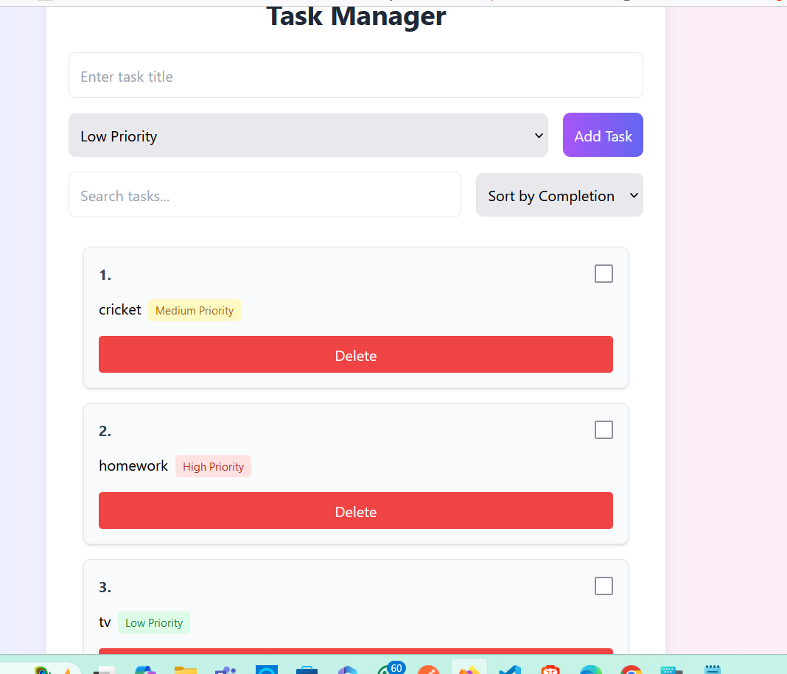
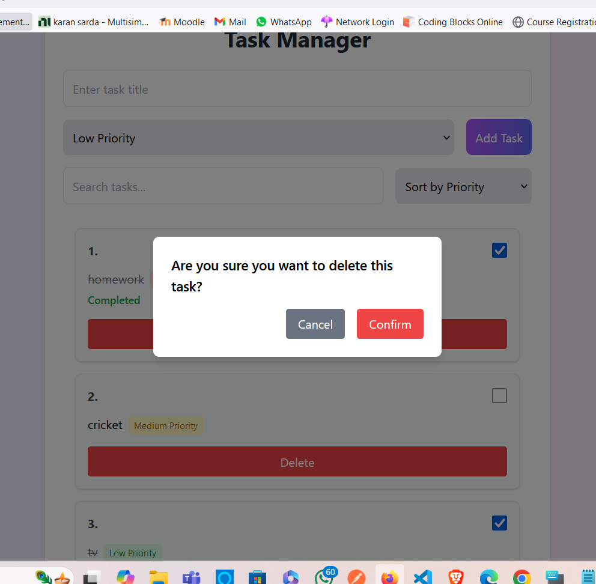
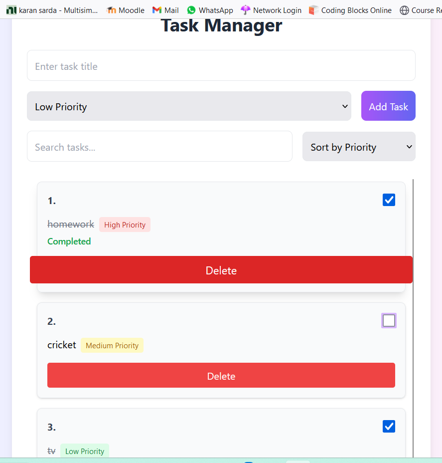
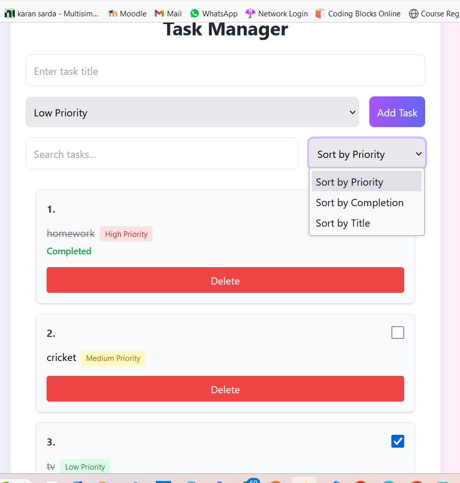

   # Task Manager Application

## Overview
The **Task Manager** is a simple yet powerful task management app that allows users to efficiently manage their daily tasks. The app provides functionality for adding tasks, marking them as completed, setting priorities, and sorting tasks by priority, title, or completion status. It also includes a search feature to easily find tasks by their titles.

## Features
- **Add, Edit, and Delete Tasks**: Users can add new tasks with a title and priority, edit them, and delete them when they're no longer needed.
- **Mark Tasks as Completed**: Tasks can be marked as completed, and this status can be toggled anytime.
- **Sort Tasks**: Tasks can be sorted by:
  - **Priority** (Low, Medium, High)
  - **Completion** (Completed tasks first)
  - **Title** (Alphabetically)
- **Search Functionality**: A search bar allows users to filter tasks by title, making it easy to find specific tasks.
- **Persistent Storage**: All tasks are saved in the local storage of the browser, so they persist even after refreshing the page.


## Technologies Used:
- **React**: For building the user interface.
- **Framer Motion**: For animations and transitions.
- **Tailwind CSS**: For styling.
- **Vercel**: For deploying the project.

# Assumptions Made During Development:
Browser Support: The app has been developed with the assumption that it will run on modern browsers such as Chrome, Firefox, Edge, and Safari.
Local Storage: The app uses local storage to persist tasks. Therefore, tasks will be saved on the local device, and any data will be lost if the local storage is cleared by the user.
No User Authentication: This version of the app does not include user authentication. All tasks are saved to the local storage, and there is no distinction between different users.

## Setup and Launch Process

### Prerequisites:
- **Node.js** (version 14 or later) installed on your machine.
- **npm** (Node Package Manager), which is typically bundled with Node.js.

### Installation:
Follow these steps to set up and run the application locally:

1. **Clone the repository**:
   ```bash
   git clone https://github.com/your-username/task-manager.git

2. # Navigate to the project directory
   cd task-manager

3. # Install the dependencies
    npm install

4. # Start the development server:
    npm start

### Deployment:

This project is deployed on **Vercel** and is available for public use. You can access the live version of the app at:


## Screenshots

### 1. Task List


### 2. Task Adding Popup


### 3. Task with Completed Status


### 4. Sorting Tasks


